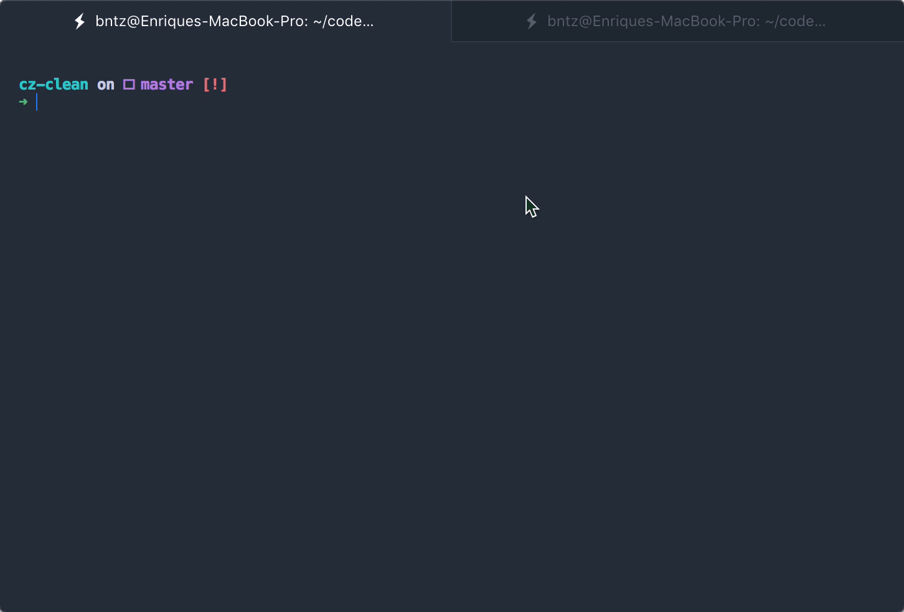

<h1 align="center">cz-clean 🛁</h1>

<p align="center">A commitizen adapter based on clean commits ✨</p>

### Why?

Clean commit history is super useful when it comes to searching and navigating through `git log`, `git blame` or through the GitHub commit history.

A clean commit history that's easy to understand tells a good story about the project. It’s evident what features were added and how they were implemented, and also makes you a better developer and collaborator.

Writing a good commit message is something people often underestimates, from co-workers to oss contributors, often writing poor commit messages which doesn't explain clearly what changes they made to the repository.

This can lead up to confusion, and finding what feature were introduced at any given point in history is a nightmare.

That's why writing a good commit and keeping a clean history is crucial when it comes to collaboration.

### Commitizen

[Commitizen](https://github.com/commitizen/cz-cli) is a super handy tool when it comes to writing commit messages, it's a `cli` script that automates the process, forcing you and your peers to write a consistent and uniform commit message by following certain guidelines you or your company specifies.

You don't need to go to the `CONTRIBUTING.md` file in order to find how the commits to some project should me made, and you are safe from making mistakes since Commitizen won't allow it if you don't specifically follow the preferred message format.

### About cz-clean 🛁

`cz-clean` is an adapter for Commitizen, it's a guideline to enforce consistent and clear commit messages, by following certain formatting rules you can make your repository Git history a delightful experience to dive in.

_Imagine this:_

```
- Add TypeScript Defs
- fix the Nav component
- UPDATE README
- refactor(Navigator): remove duplicated navigation logic
- fix tests that breaks the CI/CD pipeline
- Ad new conditionals to render text.
- move types to a single file
- Parse dates with Moment.JS
- update CONTRIBUTING file
- Do not allow to skip Slides..
- Lazy-Load Images
```

_Versus this:_

```
- types: add typescript defs
- fix: nav component
- chore: update readme
- refactor: remove duplicated navigation logic
- fix: tests breaking the ci/cd pipeline
- feat: add new conditionals to render text
- chore: move types to a single file
- feat: parse dates with moment.js
- chore: update contributing file
- feat: do not allow to skip files
- perf: lazy-load images
```

Is much better, isn't? 😉

The history is readable, understandable and easier to skim through.

`cz-clean` is based on the following principles and enforces the next rules:

- **Always define the type of change**
- **Subject must be in lowercase, always**
- **Limit the subject line to 50 characters**
- **Wrap the body at 72 characters**
- **Do not end the subject line with a period**

This adapter enforces you to follow those guidelines, either by transforming your commit message before pushing it to a branch or by throwing an error specifying what's wrong 🚨

Git commit messages are the fingerprints that you leave on the code you touch. Any code that you commit today, a year from now when you look at the same change; you would be thankful for a clear, meaningful commit message that you wrote, and it will also make the lives of your fellow developers easier.

### Installation 🔽

**Using yarn**

```console
yarn add commitizen cz-clean -D
```

**Using npm**

```console
npm i commitizen cz-clean --save-dev
```

Then in your `package.json` add:

```
...
  "config": {
    "commitizen": {
      "path": "cz-clean"
    }
  }
```

This just tells Commitizen which adapter we actually want our contributors to use when they try to commit to your repo.

And finally, add a script to your `package.json` file:

```
  ...
  "scripts": {
    "commit": "git-cz"
  }
```

Now you can run `yarn commit` or `npm run commit` and the Commitizen `cli` will run with the `cz-clean` adapter.



### Enjoy! 🍹

Remember, writing good commit messages differenciates developers who produces high quality code vs developers who produces high quality work in general 😄

If you want to learn more about Git in general, I recommend you the book [Pro Git](https://git-scm.com/book/en/v2) is available online for free and it's fantastic.

Also, if you're looking for a job as a developer, consider taking a look at [Hacker Jobs](https://hackerjobs.app) 💻

[](https://hackerjobs.app)
